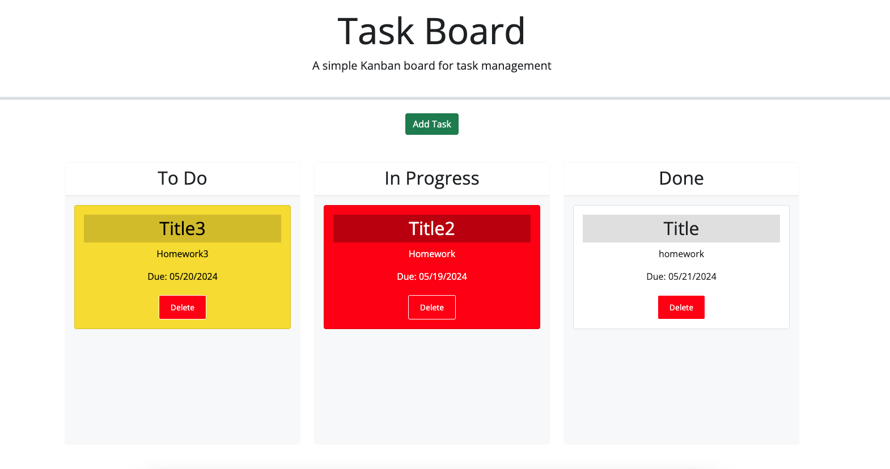

# Over-Achiever-Todo-App

A web-based app for over achievers to track their todo's and progress while finishing menial tasks no one else would bother with.

## Usage

Click the 'Add Task' to bring up the 'Add Task' window. Input the title of the task, select the date it is due, type some information concerning what the task is, then click the 'Add Task' button. A new task card will be added to the 'To-Do' column. Depending on the due date, the tasks will appear as white boxes for tasks that are not yet due, yellow boxes for tasks that are due that day, and red boxes for tasks that are past the due date. To manage task completion simply click on a task card to drag it over to the 'In Progress' column when you are working on the task, and then over to the 'Done' column when the task is finished. When you no longer need the task card simply click the 'Delete' button and the card will dissapear.

## Acknowledgements

Assistance in creating this site and its function's was made possible primarily through the starter code, bootstrap, JQuery, Jung, W3 Schools, the ever helpful TA's, and many Stack Overflow threads.

## Visuals

https://sdkwapis.github.io/Over-Achiever-Todo-App/

## Contributing

Pull requests are welcome. For major changes, please open an issue first
to discuss what you would like to change.

Please make sure to update tests as appropriate.